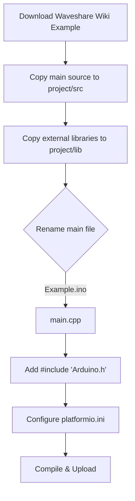

# 🚀 ESP32-S3-Touch-LCD-1.46B PlatformIO Project


This repository provides a premium template and professional guide for using the **Waveshare ESP32-S3-Touch-LCD-1.46B** with **PlatformIO**. 

> [!NOTE]  
> Official documentation from Waveshare primarily covers ESP-IDF and the Arduino IDE. This project is designed for developers who want a robust, IDE-independent workflow using PlatformIO.

---

## 🛠 Hardware Specifications

| Component | Detail |
| :--- | :--- |
| **Microcontroller** | ESP32-S3R8 Dual-core (240MHz) |
| **Display** | 1.46" Circular Touch LCD (412x412) |
| **Flash** | 16MB |
| **PSRAM** | 8MB (Octal SPI) |
| **Audio** | PCM5101 DAC + High-quality Speaker Support |
| **Sensors** | QMI8658 Gyroscope + Accelerometer |

---

## 🔄 Migration Guide: Arduino to PlatformIO

Transitioning from the official Waveshare Arduino examples is straightforward. Follow this workflow:



### Key Migration Steps:
1.  **Source Placement**: Move main `.cpp`, `.h`, and `.ino` files into your project's `src/` folder.
2.  **Library Placement**: Move all external library folders into the project's `lib/` folder.
3.  **Renaming**: Change the extension of your main sketch file from `.ino` to `.cpp`.
4.  **Forward Declarations**: Unlike Arduino IDE, PlatformIO requires you to declare functions before calling them if they appear later in the file.
5.  **Includes**: Ensure your `main.cpp` starts with `#include <Arduino.h>`.

---

## � Library Management

For complex projects or custom Waveshare drivers, you can use the **`lib/`** directory:
- **Project-specific Libraries**: Drop folder-based libraries (e.g., a custom sensor driver) directly into the `lib/` folder.
- **Automatic Inclusion**: PlatformIO will automatically compile these libraries and make them available to your project without needing specialized `platformio.ini` entries.
- **Porting Tip**: If the original Arduino example had a folder of `.cpp/.h` files next to the `.ino`, moving that folder into `lib/` is the cleanest way to manage it in PlatformIO.

---

## �📂 Project Configuration

### 1. Board Definition (`boards/`)
This project utilizes a custom board file: `waveshare_esp32_s3_lcd_146.json`. This ensures PlatformIO correctly handles the **OPI PSRAM** and **16MB Flash** specific to this hardware.

### 2. Partition Table (`partitions/`)
We use a specialized partition scheme (`esp_sr_16.csv`) to maximize the 16MB flash utility, including support for ESP-SR models and SPIFFS.

### 3. Build Configuration (`platformio.ini`)
```ini
[env:waveshare_esp32_s3_lcd_146]
platform = https://github.com/pioarduino/platform-espressif32.git
board = waveshare_esp32_s3_lcd_146
framework = arduino

monitor_speed = 115200
upload_speed = 921600

board_build.psram = enabled
board_build.partitions = default_16MB.csv

build_flags =
    -DBOARD_HAS_PSRAM
    -DARDUINO_USB_MODE=1
```

---

## 🎛 Included Demos

### 🔊 Volume Slider Demo
Inside the `src/` directory, you'll find a pre-integrated **Volume Slider Demo**. This demonstrates:
- Integration of **LVGL v8.3** on the circular display.
- Real-time touch interaction and slider events.
- Modern UI aesthetics designed specifically for the round form factor.

---

## 🎨 LVGL Design Tips

> [!TIP]  
> **Background Opacity & Color**  
> When designing your UI (especially in SquareLine Studio or raw LVGL), **do not set background opacity to 0**. On this display, an opacity of 0 often renders as pure black rather than transparency.  
> - **Recommended**: Keep `opacity` (alpha) at **255**.  
> - **Color**: Set the desired background color using a specific **HEX code** instead of relying on transparency.

---

## ⚠️ Troubleshooting

> [!IMPORTANT]  
> **Blank Screen?**  
> 1. Verify `board_build.psram = enabled` is in your `.ini`.  
> 2. Ensure `BOARD_HAS_PSRAM` build flag is present.  
> 3. Check that your display driver initialization is not hanging on SD card checks.

---

## 🔗 Resources
- 🌐 [Official Waveshare Wiki](https://www.waveshare.com/wiki/ESP32-S3-Touch-LCD-1.46B)
- 📝 [LVGL v8.3 Documentation](https://docs.lvgl.io/8.3/)
- 📦 [PlatformIO Documentation](https://docs.platformio.org/)
